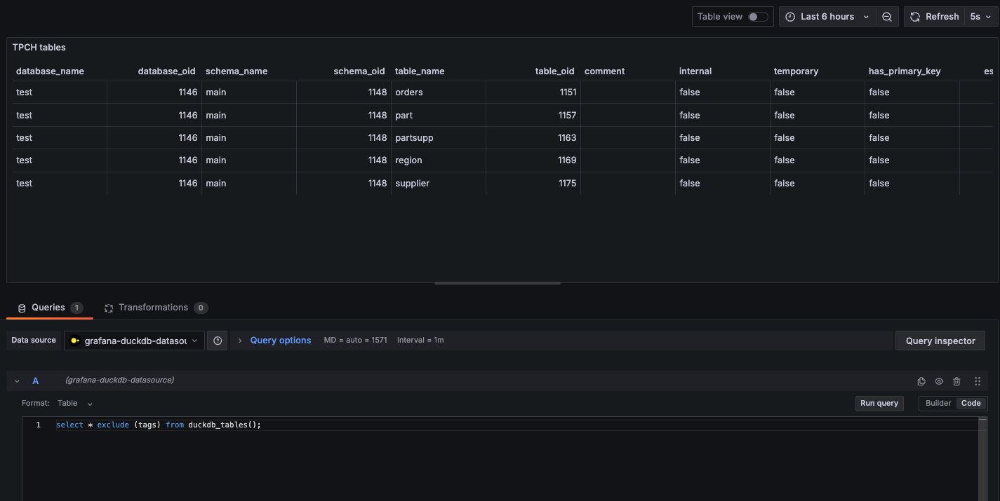

# Grafana DuckDB Data Source Plugin

The DuckDB data source plugin lets you query and visualize DuckDB data in Grafana. DuckDB is an in-process SQL OLAP database management system that provides fast analytics on local files. DuckDB's SQL dialect is derived from PostgreSQL so this plugin works similarly to the Grafana Postgres plugin and works for most SQL queries that would work in Postgres. 

The plugin is maintained by [MotherDuck](https://motherduck.com), a data platform that provides a cloud-based serverless DuckDB as a service, with additional features like data sharing, read scaling and more.




## Version Compatibility
Requires Grafana Version 10.4.0 or later.


## Features

- Query editor with syntax highlighting and auto-completion.
- Import data from various file formats (CSV, Parquet, JSON) through DuckDB extensions.
- Automatically reload the DuckDB file when the file has changed, allowing for data updates via hot-swapping the file.
- Connect to and query data in MotherDuck. 

## Installation

Download the plugin for your (OS, architecture) from the [releases page](https://github.com/motherduckdb/grafana-duckdb-datasource/releases). 

Since the plugin is currently unsigned, modify the grafana.ini file to allow unsigned plugins:

```ini
...
allow_loading_unsigned_plugins = grafana-duckdb-datasource
...

```

Then, unzip the plugin and move it to the Grafana plugins directory:


```bash
mv grafana-duckdb-datasource-<version>.zip
unzip grafana-duckdb-datasource-<version>.zip -d YOUR_PLUGIN_DIR/grafana-duckdb-datasource
```

Finally, restart the Grafana server.


## Configuration

### Data Source Options

| Name              | Description                                           | Required |
|-------------------|-------------------------------------------------------|----------|
| Path             | Path to DuckDB database file, if empty, connects to duckDB in in-memory mode.        | Yes      |
| MotherDuck Token | Token for MotherDuck API access                       | No       |

### Query Editor Options

The query editor supports standard SQL syntax and includes special Grafana macros for time range filtering and variable interpolation.

### Macros

| Macro                | Description                                        | Example |
|---------------------|----------------------------------------------------|---------|
| $__timeFilter       | Adds a time range filter using the dashboard's time range | `WHERE $__timeFilter(time_column)` |
| $__timeFrom         | Start of the dashboard time range                  | `WHERE time_column > $__timeFrom` |
| $__timeTo           | End of the dashboard time range                    | `WHERE time_column < $__timeTo` |
| $__interval         | Dashboard time range interval                      | `GROUP BY time_bucket($__interval, time_column)` |
| $__unixEpochFilter  | Time range filter for Unix timestamps              | `WHERE $__unixEpochFilter(timestamp_column)` |


## Query Examples

### Time Series Data

```sql
SELECT
  time_bucket($__interval, timestamp) AS time,
  avg(value) as average,
  max(value) as maximum
FROM metrics
WHERE $__timeFilter(timestamp)
GROUP BY 1
ORDER BY 1
```

### Table Query

```sql
SELECT
  name,
  value,
  timestamp
FROM metrics
WHERE $__timeFilter(timestamp)
LIMIT 100
```

## File Import Support

Through a rich eacosystem of extensions, DuckDB supports reading data from various file formats:

```sql
-- CSV import
SELECT * FROM read_csv_auto('path/to/file.csv');

-- Parquet import
SELECT * FROM read_parquet('path/to/file.parquet');

-- JSON import
SELECT * FROM read_json_auto('path/to/file.json');
```

## Known Issues

### Updating data in the DuckDB file
DuckDB's [concurrency support](https://duckdb.org/docs/connect/concurrency.html#handling-concurrency) does not allow multiple processes to attach the same DuckDB database file at the same time, if at least one of them requires read-write access. This means another process cannot connect to the same DuckDB database file to write to it while Grafana has it as a data source. There are a few ways to work around this:
  - Copy the DuckDB file for updates, then copy the updated DuckDB file to overwrite the original file. The plugin will automatically reload the file when it detects a change. 
  - Write to other file formats, and read using DuckDB extensions. Note that this may be much less performant than directly querying the DuckDB file.
  - Host the database using MotherDuck, which allows writing to the database while querying it from Grafana and other clients at the same time.

## Local Development

### Prerequisites

- Node.js (v20+)
- Go (v1.21+), Mage, gcc (building the backend requires CGO)

### Building Locally

#### Backend

To build the backend plugin binary for your platform, run:

```bash 
mage -v build:<platform> build:GenerateManifestFile
```
possible values for `<platform>` are: `Linux`, `Windows`, `Darwin`, `DarwinARM64`, `LinuxARM64`, `LinuxARM`.

Note: There's no clear way to cross-compile the plugin since it involves cross-compiling DuckDB via CGO.

#### Frontend

1. Install dependencies

   ```bash
   npm install
   ```

2. Build plugin in development mode and run in watch mode

   ```bash
   npm run dev
   ```

3. Build plugin in production mode

   ```bash
   npm run build
   ```

4. Run the tests (using Jest)

   ```bash
   # Runs the tests and watches for changes, requires git init first
   npm run test

   # Exits after running all the tests
   npm run test:ci
   ```

5. Spin up a Grafana instance and run the plugin inside it (using Docker)

   ```bash
   npm run server
   ```

6. Run the E2E tests (using Cypress)

   ```bash
   # Spins up a Grafana instance first that we tests against
   npm run server

   # Starts the tests
   npm run e2e
   ```

7. Run the linter

   ```bash
   npm run lint

   # or

   npm run lint:fix
   ```

## Links

- [DuckDB Documentation](https://duckdb.org/docs/)
- [Grafana Documentation](https://grafana.com/docs/)
- [MotherDuck Documentation](https://motherduck.com/docs)
- [Plugin Development Guide](https://grafana.com/docs/grafana/latest/developers/plugins/)

